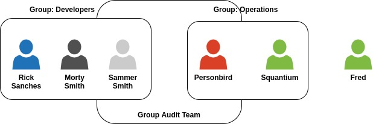

# AWS Certified Solutions Architect - Associate (SSA-C03) exam preparation

## Introduction about exam

The exam AWS Certified Solutions Architect - Associate is intended for people who perform the role of solutions architect.

The exam validates the candidate's ability to complete the following tasks:

 - Design solutions that incorporate services to meet business requirements and future needs.

 - Design secure, resilient, high-performance and cost-effective architectures.

 - Analyze existing solutions and determine how to make improvements.

## IAM & AWS CLI

### What is the IAM? 

IAM (AWS Identity and Access Management), is an internet service that helps you control access to the resources securely.
 

Root account created by default, shouldn't be used or shared 

Users are people within your organization, and can be grouped

Groups only contain users, not other groups

### IAM: Permissions

 - Users or Groups can be assigned JSON document called policies.

 - These policies define the permissions of the users.

 - In aws you apply the least privilege principle: don't give more permissions than a user needs. 

 - IAM is a global service

### IAM: Polices

Consists of
 - Verion: policy language version, always include "2021-10-17"
 - id: an identifier for the policy (optional)
 - Statement: one or more individual statements (required)
 
Statements consists of
 - Sid: an identifier for the statement (optional)
 - Effect: whether the statement allows or denies access (Allow, Deny)
 - Principal: account/user/role to which this policy applied to
 - Action: list of actions this policy allows or denies
 - Resources: list of resources to which the actions applied to
 - Condition: conditions for when this policy is in effect (optional)

 IAM Policies are JSON documents used to describe permissions within AWS. 

 ### IAM Role
  - IAM Users, applications, and services may assume IAM rules
  - User an IAM policy for permissions

 ### Bringing it all together

 - Step 1: IAM Group
 - Step 2: IAM Policy -> IAM Group
 - Step 3: IAM User -> IAM User
